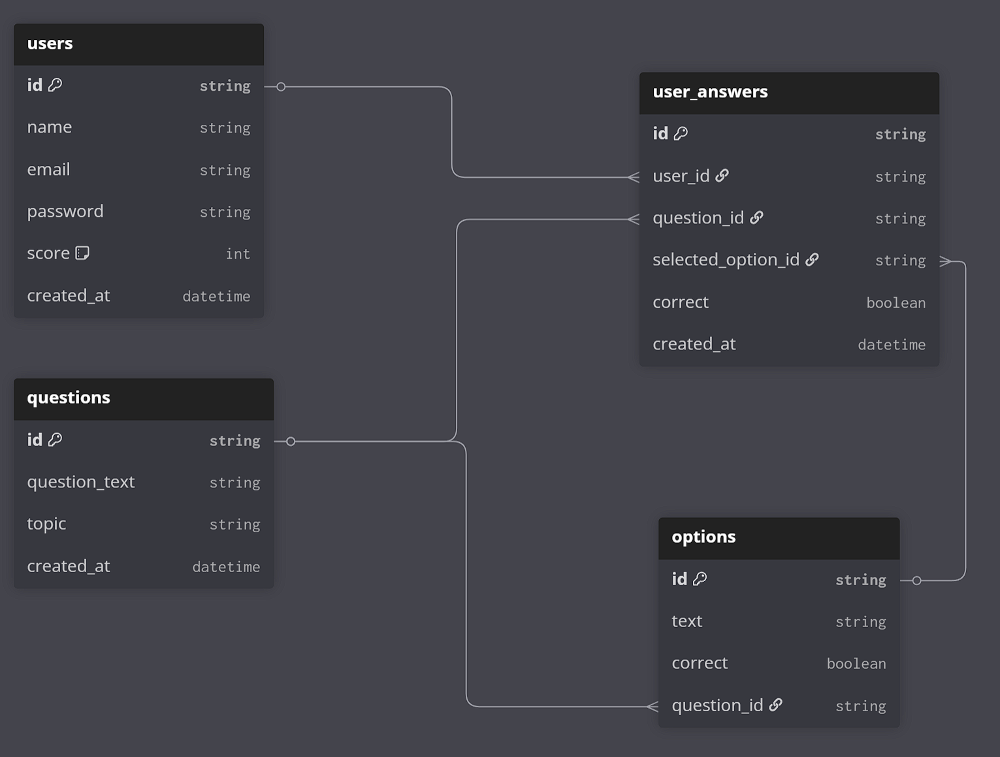
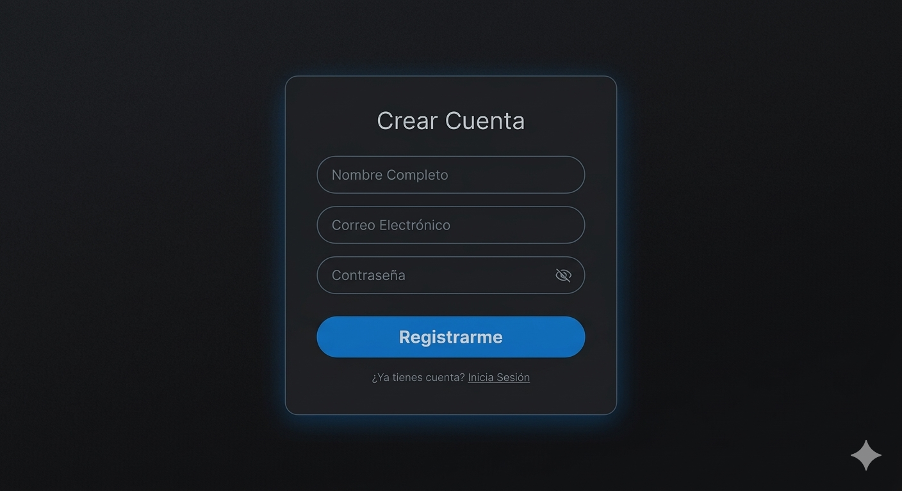
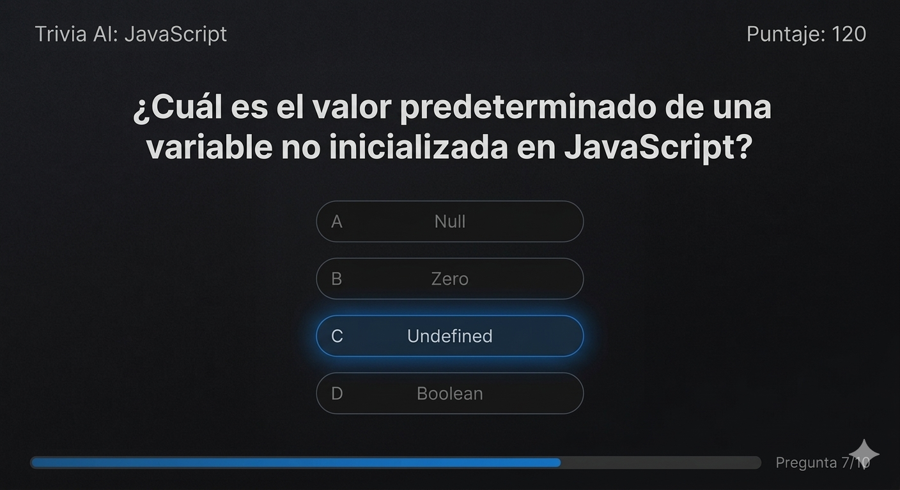
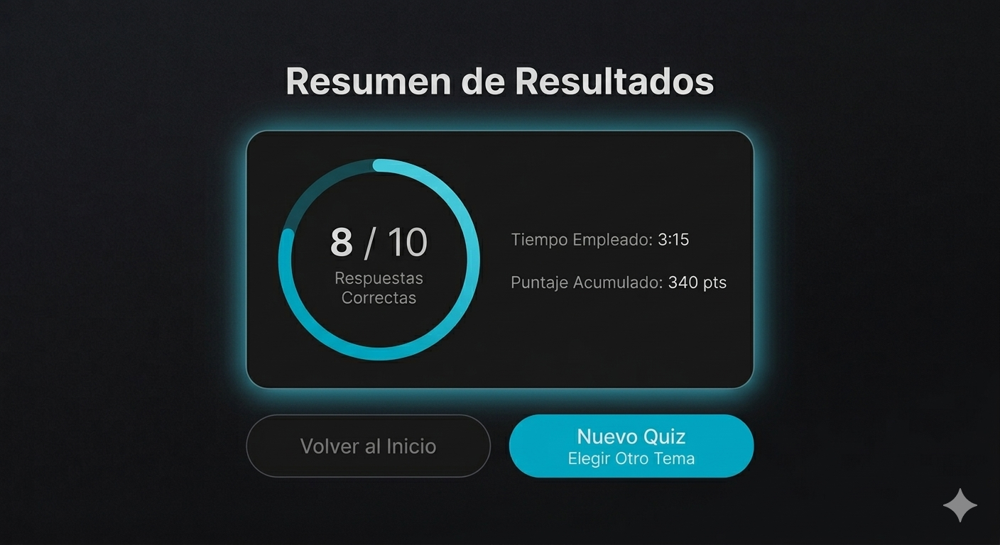

# Herramientas a Usar
    Next.js + Prisma + BD SQL

# Propuesta API
 La base de la URL es `/api`.

### Usuarios y Autenticación
Permite el registro, inicio de sesión y la administración del perfil/puntaje.

| Método | Endpoint | Cuerpo (JSON) | Descripción |
| :--- | :--- | :--- | :--- |
| **POST** | `/auth/register` | `{ name, email, password }` | Crea un nuevo usuario. |
| **POST** | `/auth/login` | `{ email, password }` | Autentica y devuelve sesión. |
| **GET** | `/users/:id` | `N/A` | Obtiene datos del usuario y su **puntaje acumulado**. |
| **PUT** | `/users/:id` | `{ name, email }` | Actualiza la información del perfil. |
| **DELETE** | `/users/:id` | `N/A` | Elimina la cuenta del usuario. |

###  CRUD de Preguntas y Opciones
Gestión completa del banco de preguntas.

| Método | Endpoint | Query Params | Descripción |
| :--- | :--- | :--- | :--- |
| **GET** | `/questions` | `limit=n` | Obtiene **n** preguntas aleatorias. |
| **GET** | `/questions` | `topic=X&limit=n` | Obtiene **n** preguntas de un **tema específico** (Ej: JavaScript). |
| **GET** | `/questions/:id` | `N/A` | Obtiene una pregunta específica con sus opciones. |
| **POST** | `/questions` | `{ question_text, topic, options: [] }` | Crea una pregunta manualmente en la BD. (Por ver)| 
| **PUT** | `/questions/:id` | `{ ... }` | Edita una pregunta existente. |
| **DELETE** | `/questions/:id` | `N/A` | Elimina una pregunta y sus opciones. |

###  Generación de Preguntas (AI Integration)
Integración con **Google Gemini API** (o similar) para automatizar el banco de preguntas.
En esta caso se genera un previamente **prompt**, en el cual se va a rellenar con el tema de elección y una cierta cantidad de preguntas.

| Método | Endpoint | Query Params  | Descripción |
| :--- | :--- | :--- | :--- |
| **POST** | `/generate` | `{ "topic": string, "quantity": number }` | Llama a la IA para generar N preguntas d eun tema en especifico y guardarlas automáticamente en la BD. |

### Juego
| Método | Endpoint | Cuerpo (JSON) | Descripción |
| :--- | :--- | :--- | :--- |
| **POST** | `/quiz/answer` | `{ userId, questionId, selectedOptionId }` | Valida si la respuesta es correcta y actualiza el score del usuario automáticamente. |

### Ejemplos de Consultas (URLs):
* **Obtener 10 preguntas al azar:** `GET /api/questions?limit=10`
* **Obtener 5 preguntas de "Ciencia":** `GET /api/questions?topic=ciencia&limit=5`

# Modelo de BD
Nosotros hemos pensado utilizar una base de datos relacional, el modelo es el siguiente:

Como se puede ber esta base de datos esta diseñada para ser un sistema de preguntas tipo quiz, donde los usarios van a poder responder preguntas y acumulan puntaje.
Se componene de 4 tablas, las cuales son:
- users
- questions
- options
- user_answer

## Tabla users
- `id` : Identificador único por usuario.
- `name` : Nombre del usuario.
- `email` : Correo unico.
- `password` : Contraseña del usuario.
- `score` : Puntaje del usuario acumulado.
- `created_at` : Fecha de registro

Esto nos permitira:
- Llevar una auntetificación (logins/registro).
- Levar puntuaje de cada usuario.

## Tabla questions
- `id` : Identificador de la pregunta.
- `question_text` : Texto de la pregunta.
- `topic` : Tema (ej. estructuras de datos).
- `created_at` : Fecha de creación.

Esto nos permitira:
- Representar un bando de registros.
- Permitir filtar por un tema en especifico.

## Tabla options
- `id` : Identificador de la opción.
- `text` : Texto de la opción.
- `correct` : Indica si es la respuesta correcta.
- `question_id` : Relación con la pregunta.

Esto nos permitira:
- Relacionar **una** pregunta con muchas posibles respuestas (1:N).
- Definir o identificar la respuesta correcta de la pregunta.

## Tabla User_answers
- `id` : Identificador.
- `user_id` : Usuario que responde.
- `question_id` : Pregunta respondida.
- `selected_option_id` : Opción elegida.
- `correct` : Si la respuesta fue correcta.
- `created_at` : Fecha.

Esto nos permitira:
- Tener un historial de preguntas con usuario,viendo cuales fueron sus errores.

## Lógica de BD
Se tiene pensado que en si el flujo al tener una pregunta y responderla sea el siguinte:
1. Usuario selecciona opcion.
2. Se compara con `options -> correct`
3. Se guarda en `user_answers`
4. Si es correcta:
    - Se incrementa `users -> score`

# 🗺️ Stitch de Interfaces - Sistema Quiz AI

### 1. Acceso y Registro
El usuario ingresa sus credenciales.

### 2. Interacción de Juego (Quiz)
En esta parte se muestran las preguntas y las 4 posibles respuestas, el usuario seleccionara una de ellas y dependiendo si es correcta o no se actualizara su puntaje.

### 3. Feedback y Progreso
Una vez concluida las preguntas se muestra el puntaje del usuario y se le pregunta si desea hacer otro quiz de otro tema.

